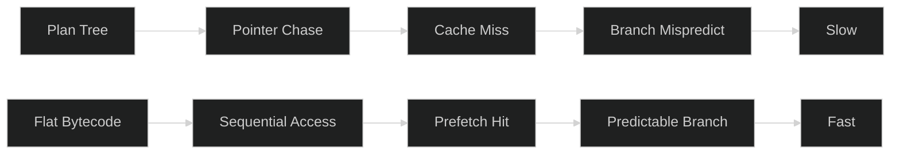
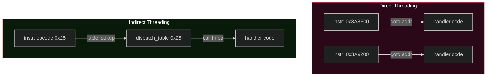

<iframe style="border-radius:12px" src="https://open.spotify.com/embed/track/1OfzXSPYxtdNRcQ5kh7T5r?utm_source=generator&theme=0" width="100%" height="152" frameBorder="0" allowfullscreen="" allow="autoplay; clipboard-write; encrypted-media; fullscreen; picture-in-picture" loading="lazy"></iframe>

*So raus!*

> le everyone: optimize LinkedIn presence

> le me: optimize dispatch loops

Tell me what did we do in more than decade?

* **BIG Data**: because "small data" doesn't get funding. big.LITTLE.
* **Docker**: we had jails, they were fine. But sure, let's wrap everything in a whale
* **microZERVICES**: taking a working monolith and turning it into a distributed debugging exercise.
* **Kubernetes?**: the best thing alive after dinosaurs. Also, similarly sized YAML files...
* **Serverless**: there's definitely a server, or? cake is a lie?
* **Blockchain**: chained to the ground at 60K USD. "Decentralize everything" while running 3 nodes. :D
* **GraphQL**: writing a query language to avoid writing a query language
* **Low-code**: look ma, I have no code.
* **NFTs**: right-click, save as, move on
* **LLMs**: nobody talks about SLMs and GANs anymore. Attention (ya know) is all you need
* **AI Agents**: much wow. Very autonomous. Still can't merge without breaking CI

Meanwhile, I stayed behind the moon, knee-deep in perf traces, increasingly convinced that the database industry 
has been doing instruction encoding wrong since the Volcano paper.
You stop caring about being out of touch when the numbers prove you right.
I mean, I am not saying, industry achieved things. But I find 
[these](https://hacks.mozilla.org/2026/02/making-webassembly-a-first-class-language-on-the-web/) useless nowadays.

I've been staring at bytecode dumps for the better part of those years. Not because I enjoy it (actually I do) 
because when you're building a query engine that needs to process a billion rows without flinching,
the shape of your software (and instructions) starts to matter a lot more than most people think.

Most query engine builders don't think about instruction encoding at all. Parse SQL, build a plan tree, walk it, ship it. 
If you're ambitious, maybe you generate some bytecode and interpret that. 
But the actual byte layout? The width of an instruction? Nobody talks about it. It's treated like plumbing.

It shouldn't be. This stuff determines whether your VM fits in L1 cache or thrashes it, whether your dispatch loop is predictable or a branch misprediction festival, and ultimately whether your interpreter is the bottleneck or invisible. When you're doing OLAP over billions of rows, that distinction is not academic.

This is what I learned building the bytecode for [ScramVM](https://vertexclique.com/blog/morsels-compilation-people/). Not the opcodes. The decisions underneath them.

## Why Bytecode at All?

The standard architecture for a query engine is a tree of operator nodes. Scan, Filter, Project, Aggregate, Join. Each one implements a `next()` or `next_batch()` method. Data flows up the tree. This is the [Volcano model](https://paperhub.s3.amazonaws.com/dace52a42c07f7f8348b08dc2b186061.pdf) and it's been the default since 1994.

It works. But there's a cost hiding in plain sight: **pointer chasing**.

Every call to `next()` goes through a vtable or function pointer. Every operator lives somewhere on the heap. Following the plan tree means bouncing around memory, polluting your instruction cache, mispredicting at every operator boundary. For OLTP touching a few rows? Fine. For OLAP scanning millions? It adds up fast, and if you've profiled this, you already know the feeling. The execution engine isn't doing the work, it's busy finding the next piece of work.

Bytecode flattens everything. Instead of a tree of heap-allocated nodes, you get a contiguous array of instructions:

```
fetch → decode → dispatch → repeat
```

Sequential. Dense. Your CPU's prefetcher can predict the access pattern perfectly because it's literally just incrementing a pointer. No chasing, no virtual dispatch.



There's a less obvious benefit: bytecode is a natural compilation target. Once you have it, you can inspect it, optimize it, cache it. The bytecode sits between your planner and your execution backend as an IR.

## How Wide Is an Instruction?

This is the first decision you make and it ripples through everything else.

Variable-length instructions (x86 style) are compact but awful to decode. You can't jump to instruction N without scanning from the start. Fixed-width instructions (ARM, RISC-V style) waste some space but give you O(1) random access, trivial decoding, and a predictable memory pattern.

For a database VM, this isn't close. Your dispatch loop runs millions of times per query. Every cycle spent on length-decoding is a cycle you're not spending on actual computation. And "wasted space" means nothing when your typical query compiles to 40 instructions.

So: fixed-width. But how many bytes?

**1 byte**? Too small. You need an opcode and at least one operand.

**8 bytes**? Comfortable, wasteful. You're burning cache lines on padding for operand fields you'll never fill.

**4 bytes**. And here's where it gets almost suspiciously clean:

```
┌──────────┬──────────┬───────────────────┐
│  opcode  │  flags   │     operand       │
│  (1 byte)│ (1 byte) │    (2 bytes)      │
└──────────┴──────────┴───────────────────┘
```

One byte of opcode: 256 operations. Way more than any query VM will ever need. One byte of flags for modifiers: is it register-addressed? is the operand wide? is the value nullable? Two bytes for the operand: indices up to 65,535. Enough for constant pool lookups, jump offsets, column indices, register addresses. More than enough.

The instruction is `Copy` in Rust. No heap. No refcount. A single aligned `u32` read. At 4 bytes per instruction, a typical 50-instruction analytical query compiles to **200 bytes**. Roughly **three cache lines**.

That number matters more than it sounds like. Your L1 data cache is typically 32–64 KB. The entire query program, the dispatch table, and the hot constants all fit in L1 simultaneously without evicting each other. You're running a query engine from cache. The whole thing.

## When Two Bytes Aren't Enough

65,535 possible operand values. That's enough almost always. "Almost" is a dangerous word in systems programming though, and I've learned to be scared of it.

What if a query references constant pool index 70,000? Jump offset beyond 16 bits? You have three options:

**Option 1: Widen everything to 8 bytes.** This is what most people default to. It's also wrong. You're doubling every instruction to handle a case that fires maybe once per ten thousand queries.

**Option 2: Prefix instruction.** Emit a `WIDE` opcode before the instruction that needs extended operands. This is what the JVM does. It works but it complicates your dispatch loop and breaks the property that instruction N always lives at offset N×4.

**Option 3: Side table.** Keep instructions at 4 bytes. When an operand overflows, set a flag bit and store the actual value in a separate `wide_operands: Vec<u32>`. The 16-bit field becomes an index into this table.

```
Normal:
┌──────────┬──────────┬───────────────────┐
│  opcode  │  0x00    │   operand (u16)   │
└──────────┴──────────┴───────────────────┘

Wide:
┌──────────┬──────────┬───────────────────┐
│  opcode  │  WIDE=1  │ side_table_index  │
└──────────┴──────────┴───────────────────┘
           ↓
    wide_operands[side_table_index] → actual u32 value
```

Option 3. Every time. The common path pays zero cost. The rare path pays one array lookup that barely ever fires. Your instruction stream stays clean, your dispatch stays simple, the side table sits in cold memory where it belongs.

This is a general principle I keep coming back to: **don't bloat the common case for the rare case.** Put the rare stuff in a side table and pay for it only when you need to.

## Organizing 256 Opcodes

You could assign opcodes sequentially as you add operations. Don't do this. You'll hate yourself the first time you stare at a hex dump trying to figure out why your query computed the wrong thing.

Partition the space by function family:

```
0x00–0x0F  Control flow     (halt, jump, call, return)
0x10–0x1F  Load/Store       (constants, columns, locals)
0x20–0x2F  Arithmetic       (add, sub, mul, div, mod, cast)
0x30–0x3F  Comparison       (eq, ne, lt, le, gt, ge, null checks)
0x40–0x4F  Logical          (and, or, not)
0x50–0x5F  Aggregation      (count, sum, avg, min, max, group-by)
0x60–0x6F  Batch operations (filter, project, sort, append)
    ...
0xA0–0xCF  Register-addressed variants of the above
0xD0–0xDF  Pipeline control
0xE0–0xEF  Index operations
0xF0–0xFF  Window functions
```

When you see `0x35` in a dump, you instantly know it's a comparison. Each family gets 16 slots and you won't fill them all initially. Room to grow without reshuffling.

Notice the register-addressed variants in `0xA0–0xCF`. That's not arbitrary. It comes from the hybrid execution model I'll explain next.

## Stack or Registers? Both, Actually

Classical VM design frames this as a binary choice. Stack VMs (JVM, CPython, WebAssembly) push and pop 
(in here, I want to reference Popek and Goldberg for the properties of a stack based VM for true VM behavior. 
Only JVM qualifies for all three properties. I am so done with explaining these to people at all.)
Register VMs (Lua 5, Dalvik) address operands by number. The research says register VMs execute fewer instructions but need wider encodings.

For a general-purpose language VM, that's a real trade-off. For a database query engine, the framing is wrong because of something that should be obvious but took me a while to internalize: **your values are not uniform**.

A language VM deals primarily with scalars. A database VM deals with scalars *and* columnar batches. A `RecordBatch` with a million rows is not the same kind of thing as the integer `42`. If you put both on the same stack, your stack entries need to be tagged unions large enough for either (wasteful for scalar arithmetic) or you box them, which is wasteful in a different way.

The honest design acknowledges both:

- **A register file** for named values that persist: the current batch, filtered output, aggregation accumulators. Pre-allocated flat array, no HashMap, direct indexing.

- **An operand stack** for intermediate scalar work: arithmetic, comparisons, boolean logic. Fixed-size, because expression depth in SQL is bounded and queries aren't recursive.

Registers give you O(1) access to any named value without push/pop ceremony. The stack gives you compact expression evaluation without burning register slots on temporaries. Register-addressed opcodes live in `0xA0–0xCF`. Stack-addressed opcodes live in `0x20–0x4F`.

It's more complex than either pure model. It's also more honest about what the workload actually looks like. Database values are heterogeneous. The encoding should be too.

## The Dispatch Loop: A Story About Threading

Ok, here's where it gets interesting. You have your bytecode. Now you need to actually execute it. The dispatch loop is the innermost hot loop of the interpreter. Every single instruction passes through it. This is where people have been arguing for decades, and the argument is basically about how you jump from one instruction handler to the next.

### Switch Dispatch: The Baseline Nobody Should Ship

The simplest approach. A `match` on the opcode:

```rust
loop {
    let instr = code[ip];
    ip += 1;
    match instr.opcode {
        HALT => return Ok(()),
        ADD => { /* ... */ }
        FILTER_BATCH => { /* ... */ }
        // ... 67 more arms
    }
}
```

Simple, portable, and slow. The CPU's branch predictor sees one indirect branch and has no way to predict it well. Every dispatch is a coin flip from the predictor's perspective. For a hot loop that runs millions of times, that's death by a thousand mispredictions.

I've seen people ship this in production query engines. It works, in the sense that it produces correct results. It does not work in the sense of being anywhere close to as fast as it could be.

### Direct Threading: The Clever C Trick That Doesn't Exist in Rust

This is the classic optimization from the Forth and interpreter communities. The idea: instead of a centralized switch, each handler ends with `goto *dispatch_table[next_opcode]`. Every handler has its own branch site, giving the branch predictor N separate branches to learn instead of one.

In GCC/Clang, you do this with computed gotos (`&&label`). It's measurably faster than switch dispatch (Fig4 in paper)
[Ertl and Gregg (2003)](https://www.jilp.org/vol5/v5paper12.pdf) showed this pretty conclusively.

The problem? It's a compiler extension. It doesn't exist in Rust. And even in C, you end up fighting the compiler about code layout because the quality of generated code depends heavily on how the compiler arranges the handlers in memory. One innocent refactor can tank your branch prediction because the compiler moved things around.

### Indirect Threading: What Forth Got Right in the 1970s

Here's the one that doesn't get enough attention, and it's the one I want to spend time on, because it's the conceptual ancestor of what I actually do.

Indirect threading comes from [Forth](https://www.bradrodriguez.com/papers/moving1.htm). In a directly threaded VM, the instruction stream contains raw code addresses. Each "instruction" is literally a pointer to machine code. In an *indirectly* threaded VM, there's a level of indirection: each instruction points to a data structure (historically called a "code field"), and that structure contains the actual code pointer.

Why would you want an extra indirection? Several reasons that turned out to matter:

**Polymorphism without vtables.** In Forth, the same "word" can have different implementations depending on context: immediate words, constant words, variable words, colon definitions. The indirect threading lets you swap the code pointer without changing the instruction stream. Applied to a database VM: the same opcode can dispatch differently depending on type context. Your `ADD` handler for integers and your `ADD` handler for decimals live behind different function pointers, and you pick the right table at query compile time rather than branching at runtime.

**Table swapping.** This is the real trick. With indirect threading, your dispatch table is data, not code. You can swap the entire table. Want to trace every instruction? Swap in a table where every handler logs before delegating. Want to profile? Swap in a table with timing wrappers. Want to run in a debug mode that validates invariants? Different table. The instruction stream never changes. The dispatch surface is a runtime parameter.

**Cache behavior.** The level of indirection sounds like it would be slower, and in micro-benchmarks on tight loops it is. By a few nanoseconds. But in a database VM, your handlers aren't tiny. A `FILTER_BATCH` handler does real work: evaluating predicates over thousands of rows in a columnar batch. The dispatch overhead is noise compared to the handler body. What matters is that the dispatch table is small, hot, and stays in L1.



Forth figured this out in the 1970s. The database world is only now catching up, and honestly most query engines still haven't.

### Token Threading: Where I Landed

What I actually use in ScramVM is closest to what the literature calls **token threading**, a refinement of indirect threading where the "tokens" are small indices (the 1-byte opcodes) into a statically allocated function pointer table:

```rust
type Handler = fn(vm: &mut VM, instr: Instruction) -> Result<()>;

static DISPATCH: [Handler; 256] = {
    let mut table = [handle_invalid as Handler; 256];
    table[op::HALT as usize] = handle_halt;
    table[op::ADD as usize] = handle_add;
    table[op::FILTER_BATCH as usize] = handle_filter_batch;
    // ...
    table
};

// The hot loop
loop {
    let instr = unsafe { *code_ptr.add(ip) };
    ip += 1;
    if instr.opcode == op::HALT { return Ok(()); }
    DISPATCH[instr.opcode as usize](self, instr)?;
}
```

256-entry array of function pointers, built at compile time. Dispatch is an array index and an indirect call. No `match`, no computed goto, no GCC extensions. The table is 2 KB (256 × 8 bytes), fits in L1 easily, and stays resident because you hit it every single instruction.

Is it as fast as computed goto in micro-benchmarks? No. Computed goto wins by a small margin because each branch site is unique. In practice, for database workloads? The difference evaporates. Here's why: your opcodes aren't uniformly distributed. A typical query hits `LOAD_COLUMN`, `FILTER_BATCH`, `PROJECT_BATCH`, and `AGG_BATCH` millions of times in a loop, while control flow opcodes fire once. The branch predictor learns the dominant pattern fast, and the table dispatch becomes effectively predicted.

But the real advantage is the one I borrowed from indirect threading: **the table is data**. I can swap it. In development I run with a tracing table that logs every dispatch. In production I run with the bare table. When profiling I swap in a table that captures timing per-handler. Each handler lives in its own file. The codebase stays modular. I never fight the compiler about where it puts my code.

> Simple things that work beat clever things that almost work. Always.

## The Cache Above the Cache

Here's something most programmers get wrong about x86. You've been taught that L1 is the "top level" cache. L1 instruction cache, L1 data cache, that's as close as you get to the core.

It's not quite true anymore.

Modern x86 CPUs have a **micro-op cache** that sits above the L1 instruction cache. Intel calls it the [Decoded Stream Buffer (DSB)](https://chipsandcheese.com/p/skylake-intels-longest-serving-architecture). AMD calls it the [Op Cache](https://chipsandcheese.com/2021/07/03/how-zen-2s-op-cache-affects-performance/). Same idea: cache pre-decoded micro-ops so the CPU can skip the entire x86 decode stage on hot paths.

Why does this exist? Because x86 instruction decoding is *expensive*. Variable-length instructions, complex prefix rules, the whole legacy mess. The decode pipeline (Intel calls it MITE, Micro-instruction Translation Engine) is power-hungry and throughput-limited. The micro-op cache bypasses all of it. When your hot loop hits the DSB, you're feeding pre-decoded micro-ops directly to the backend, saving 2–4 cycles of decode latency per fetch and significant power on top.

The numbers across generations tell a story:

| Generation | Micro-op Cache Capacity | Delivery Bandwidth |
| :--- | :--- | :--- |
| Intel Sandy Bridge (2011) | 1,536 µops | 4 µops/cycle |
| Intel Skylake (2015) | 1,536 µops | 6 µops/cycle |
| Intel Golden Cove (2021) | 4,096 µops | 8 µops/cycle |
| AMD Zen 2 (2019) | ~4,096 µops | 8 µops/cycle |
| AMD Zen 4 (2022) | ~6,750 µops | 9 µops/cycle |

Chip architects keep making these bigger. That should tell you something about how important they think this is.

Now here's why this matters for the dispatch loop. The hot path (fetch instruction, index into dispatch table, indirect call) is maybe a dozen x86 instructions. That fits comfortably in the micro-op cache and *stays* there, because it's the tightest, hottest loop in the entire system. The CPU doesn't just avoid cache misses. It avoids *decoding*. It's running from pre-decoded micro-ops on every single dispatch.

If your dispatch loop spills out of the micro-op cache, you start paying decode penalties on every iteration, and you also eat [DSB-to-MITE switch](https://blog.codingconfessions.com/p/how-to-leverage-the-cpus-micro-op) penalties as the frontend oscillates between the two paths. This is measurable. It's one of those performance cliffs that looks completely mysterious until you know what the DSB is.

This is another reason compact bytecode wins. It's not just about L1 data cache holding your instruction stream. It's about L1 instruction cache (and the micro-op cache above it) holding your *dispatch loop*. A tight token-threaded loop stays in the DSB permanently. A bloated switch statement with 70 case arms might not. A computed-goto dispatcher with 70 separate branch sites definitely stresses it more.

The whole stack of caches (micro-op cache for the dispatch loop, L1 data cache for the bytecode stream and dispatch table) is working in your favor when everything is small and tight. When you bloat any part of it, you fall off a cliff you didn't know was there.

## Making the Cache Argument Concrete

A moderately complex analytical query (filtered aggregation with group-by on a billion-row table) compiles to roughly 50 instructions. At 4 bytes each: **200 bytes**. L1 cache line is 64 bytes. That's **~3 cache lines**.

Constants: maybe 10 entries at 16 bytes. 160 bytes. Two and a half more lines.

Dispatch table: 2 KB. 32 cache lines. But it's `static`. Shared across all queries, always resident.

Per-query working set: ~**400 bytes**. That doesn't even register as cache pressure.

Compare this to a Volcano-style plan tree: 6–8 operator nodes, each a heap-allocated struct with vtable pointers, child pointers, field data, scattered across the heap. Maybe 2–4 KB of actual data, but the access pattern (random pointer chasing) makes it effectively uncacheable. You spend cycles fetching your own execution engine instead of doing work.

This is why bytecode VMs are fast despite being "interpreted." The dispatch overhead is tiny and cache-hot. The actual work (filtering, aggregating, projecting on columnar batches) dominates. Your cycles go to computation, not to chasing pointers through your own machinery.

## Where This Leaves Me

Bytecode design for query engines sits at a weird intersection. The language VM community has decades of literature on instruction encoding, dispatch, register allocation. The database community has decades of literature on query optimization, join algorithms, storage. The overlap (how to encode database operations as efficient bytecode) has surprisingly little written about it.

Here's what I'd tell someone starting today:

1. **Fixed-width, 4 bytes.** Seriously, it's enough. Don't let edge cases bloat the common path.
2. **Side tables for overflow.** Keep the instruction stream pristine. Cold metadata lives elsewhere.
3. **Partition your opcode space.** Future-you debugging at 2am will be grateful.
4. **Hybrid value model.** Database values aren't uniform. Stop pretending they are.
5. **Indirect/token threaded dispatch.** Simple, fast, swappable, debuggable. Don't reach for computed goto until you've measured and found the table wanting. You probably won't.

None of this is revolutionary on its own. What surprised me is how well they compose. The result is an interpreter that's almost invisible. A thin dispatch layer wrapped around the real work of crunching columnar data.

Three cache lines. That's all a query engine needs to be.

### Links

- [Volcano Model (Graefe, 1994)](https://paperhub.s3.amazonaws.com/dace52a42c07f7f8348b08dc2b186061.pdf): The original iterator-based execution model
- [MonetDB/X100: Hyper-Pipelining Query Execution (Boncz et al., 2005)](https://www.cidrdb.org/cidr2005/papers/P19.pdf): Vectorized execution that started the batch processing conversation
- [Morsel-Driven Parallelism (Leis et al., 2014)](https://db.in.tum.de/~leis/papers/morsels.pdf): The parallelism strategy that complements bytecode execution
- [The Structure and Performance of Efficient Interpreters (Ertl & Gregg, 2003)](https://www.jilp.org/vol5/v5paper12.pdf): The definitive dispatch mechanism benchmark paper
- [Virtual Machine Showdown: Stack vs. Registers (Shi et al., 2008)](https://www.usenix.org/legacy/events/vee05/full_papers/p153-yunhe.pdf): Stack vs register VM trade-offs
- [Moving Forth (Rodriguez)](https://www.bradrodriguez.com/papers/moving1.htm): Threading techniques in Forth, where most of these ideas originated
- [Threaded Code (Bell, 1973)](https://dl.acm.org/doi/10.1145/362248.362270): The original paper on threaded interpretation
- [Indirect Threaded Code (Dewar, 1975)](https://dl.acm.org/doi/10.1145/360825.360849): The formalization of indirect threading in Communications of the ACM
- [The Microarchitecture of Intel, AMD, and VIA CPUs (Agner Fog)](https://www.agner.org/optimize/microarchitecture.pdf): The definitive reference on x86 micro-op caches, decode pipelines, and frontend behavior
- [How Zen 2's Op Cache Affects Performance (Chips and Cheese)](https://chipsandcheese.com/2021/07/03/how-zen-2s-op-cache-affects-performance/): Detailed analysis of AMD's micro-op cache
- [Skylake: Intel's Longest Serving Architecture (Chips and Cheese)](https://chipsandcheese.com/p/skylake-intels-longest-serving-architecture): Intel DSB and frontend pipeline details
