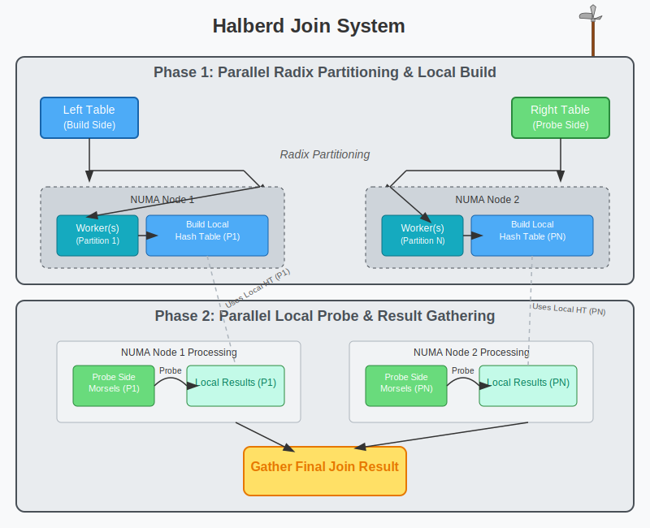

## Introduction: The Data Sovereignty Imperative & The Join Bottleneck

In an era demanding data privacy and control, the ability to generate powerful AI insights *locally*, within your own infrastructure, is paramount. Enterprises are building sophisticated on-premise data lakehouses, aiming to leverage their unique data assets without exposing them to external risks or third-party corporations. But a formidable dragon guards this treasure trove: the **JOIN operation**. Joining massive, disparate datasets – the very foundation of comprehensive analysis and effective AI model training – becomes a crippling bottleneck on local hardware. Traditional join algorithms crumble under the weight of billions of records, constrained by local memory, inefficient parallelism, and crippling load imbalances. This isn't just a performance issue; it's a roadblock to realizing the promise of secure, on-premise AI.

Our **Halberd Join System** – a revolutionary approach specifically engineered to shatter this bottleneck. By leveraging adaptive, morsel-driven parallelism, Halberd delivers unprecedented join performance *on your hardware*, making powerful local data analysis and AI not just possible, but efficient.

**NOTE:** Our full on-premise platform, consists of local semantic AI for your day to day operations with the system that is explained in this blog post.

## What is Morsel-Driven Parallelism?

Before diving into Halberd, let's understand morsel-driven parallelism. This execution model breaks down data processing into small, manageable chunks called "morsels." Rather than statically assigning large blocks of data to worker threads (often inefficiently), morsel-driven systems dynamically distribute these bite-sized pieces of work across available cores within your local cluster. This enables superior load balancing and responsiveness, maximizing the utility of your on-premise compute resources.

## The Halberd Metaphor: Battle-Ready Data Processing on Your Turf

The name "Halberd" isn't arbitrary - it's a powerful metaphor that illuminates how this join system operates within your controlled environment.



Imagine your local data center or private cloud as a strategic battlefield:
- **Morsels are cavalry units**: Fast, nimble chunks of your local data racing across your internal network.
- **Worker threads are skilled riders**: Each guiding their morsels through processing stages, optimizing for your specific hardware (like NUMA architectures).
- **The coordinator is the field commander**: Orchestrating the join strategy entirely within your secure perimeter.
- **The halberd itself is the join mechanism**: A versatile weapon combining different processing tactics based on the nature of your local data and the query's demands.

Just as a halberd combines an axe, spear, and hook – allowing versatile combat approaches – the Halberd Join System adaptively combines different processing strategies to deliver peak performance for joining *your* data, *locally*.

## How Halberd Works: The Battle Plan for Local Data

### Phase 1: Cavalry Deployment (Parallel Morsel Processing within Your Walls)

In the first phase, data is divided into small morsels from both join relations, sourced directly from your local lakehouse or database. Like cavalry units receiving orders on home ground, these morsels are dispatched to worker threads across your cluster:

```
┌──────────────────────────────────────────────────────────┐
│                                                          │
│  ┌─────────┐   ┌─────────┐   ┌─────────┐   ┌─────────┐   │
│  │ Morsel  │   │ Morsel  │   │ Morsel  │   │ Morsel  │   │
│  │ (Left)  │   │ (Left)  │   │ (Right) │   │ (Right) │   │
│  └────┬────┘   └────┬────┘   └────┬────┘   └────┬────┘   │
│       │             │             │             │        │
│       ▼             ▼             ▼             ▼        │
│  ┌────┴────┐   ┌────┴────┐   ┌────┴────┐   ┌────┴────┐   │
│  │ Worker  │   │ Worker  │   │ Worker  │   │ Worker  │   │
│  │ Thread  │   │ Thread  │   │ Thread  │   │ Thread  │   │
│  └────┬────┘   └────┬────┘   └────┬────┘   └────┬────┘   │
│       │             │             │             │        │
│       └─────────────┼─────────────┼─────────────┘        │
│                     │             │                      │
└─────────────────────┼─────────────┼──────────────────────┘
                      │             │
                      ▼             ▼
```

Each worker processes its assigned morsels locally, maintaining NUMA-awareness by keeping data processing on the same socket where the data resides within your servers. This maximizes efficiency on *your* hardware, minimizing cross-node communication overhead.

### Phase 2: The Halberd Strike (Secure Coordinator Join)

Once the parallel morsel processing is complete, the field commander (coordinator node, still within your secure environment) takes the partial results generated by the workers and executes the main join logic:

```
                     ┌─────────────────┐
                     │                 │
┌────────────────────┤   Coordinator   ├────────────────────┐
│                    │                 │                    │
│                    └─────────────────┘                    │
│                             │                             │
│                             ▼                             │
│                    ┌─────────────────┐                    │
│                    │  Combine Left   │                    │
│                    │     Results     │                    │
│                    └────────┬────────┘                    │
│                             │                             │
│                             ▼                             │
│                    ┌─────────────────┐                    │
│                    │ Combine Right   │                    │
│                    │     Results     │                    │
│                    └────────┬────────┘                    │
│                             │                             │
│                             ▼                             │
│                    ┌─────────────────┐                    │
│                    │  Build Hash     │                    │
│                    │     Table       │                    │
│                    └────────┬────────┘                    │
│                             │                             │
│                             ▼                             │
│                    ┌─────────────────┐                    │
│                    │  Probe Hash     │                    │
│                    │     Table       │                    │
│                    └────────┬────────┘                    │
│                             │                             │
└─────────────────────────────┼─────────────────────────────┘
                              │
                              ▼
```

This centralized build/probe phase, executed efficiently on the coordinator, ensures data integrity and avoids the complexities of massively distributed hash tables, while still keeping all processing within your controlled environment.

### Phase 3: Adaptive Post-Processing (Tailored Local Execution)

Here's where the Halberd System's intelligence truly benefits on-premise scenarios. Processing the *results* of a massive join can itself be resource-intensive. Halberd dynamically chooses the best approach based on the result size and available local resources:

```
                 ┌───────────────────────┐
                 │  Joined Result Ready  │
                 └───────────┬───────────┘
                             │
                             ▼
                      ┌──────────────┐
                      │  Evaluate    │
                      │  Workload    │
                      └──────┬───────┘
                             │
               ┌─────────────┴─────────────┐
               │                           │
               ▼                           ▼
┌─────────────────────────┐     ┌─────────────────────────┐
│     Small Workload?     │     │     Large Workload?     │
│       Sequential        │     │        Parallel         │
│     Post-Processing     │     │     Post-Processing     │
└─────────────┬───────────┘     └─────────────┬───────────┘
              │                               │
              └───────────────┬───────────────┘
                              │
                              ▼
                 ┌─────────────────────────┐
                 │      Final Result       │
                 │ (Ready for Local AI/BI) │
                 └─────────────────────────┘
```

- **For smaller results**: Processing continues synchronously on the coordinator (like a halberd's direct spear thrust) – minimizing overhead for simpler tasks.
- **For larger results**: Processing is parallelized across workers (like a halberd's powerful axe swing) – leveraging your cluster's full power for heavy lifting.

This adaptive strategy prevents wasting resources on unnecessary parallelization overhead for small results, while ensuring massive results are processed using the full capacity of your local infrastructure.

## The Halberd Advantage: Enabling Secure, Local AI

The Halberd Join System's brilliance lies in how its efficiency translates directly into enabling your on-premise data strategy:

1.  **Unlocks On-Premise AI & Lakehouse Potential**: By drastically accelerating the join bottleneck, Halberd makes it feasible to process and prepare the large, joined datasets required for sophisticated AI models and analytics *entirely within your infrastructure*.
2.  **Maximizes Local Hardware Investment**: Adaptive execution and NUMA-aware processing ensure you get the most performance out of your existing servers and network.
3.  **Ensures Data Sovereignty**: All processing, from morsel distribution to final join, happens locally. Your sensitive data never needs to leave your control or be exposed to external services for processing. Including the AI itself. All platform components reside in your infrastructure.
4.  **Perfect Load Balancing**: Dynamic morsel assignment ensures optimal utilization of your local compute resources, preventing hotspots and maximizing throughput.
5.  **Scalability for Local Data Growth**: Performs exceptionally well as your local data lakehouse grows, ensuring your analytics and AI capabilities can keep pace.
6.  **Eliminates Unnecessary Overhead**: Intelligent adaptivity avoids the communication and synchronization costs that cripple less sophisticated parallel join methods, especially in latency-sensitive local environments.

## Halberd vs. Traditional Join Approaches

| Approach            | Data Distribution | Join Execution | Post-Processing | Adaptability | Suitability for On-Premise AI |
| :------------------ | :---------------- | :------------- | :-------------- | :----------- | :---------------------------- |
| Traditional Volcano (PostgreSQL, Datafusion, Pandas, Polars) | Static partition  | Distributed    | Always parallel | Low          | Poor (Inefficient, Bottlenecks) |
| Fully Distributed (SparkSQL, Trino, Tableau)   | Dynamic chunks    | Distributed    | Always parallel | Medium       | Moderate (High Overhead)      |
| Centralized         | Dynamic chunks    | Centralized    | Always sequential | Low          | Limited (Sequential Bottleneck) |
| **Halberd** (ScramDB) | Dynamic morsels   | Centralized    | Adaptive (seq/par) | **High** | **Excellent (Efficient & Secure)** |

## Conclusion: Secure Your Data, Unleash Your Insights with Halberd

The dream of powerful, on-premise AI and analytics, fueled by your unique local data lakehouse, hinges on the ability to efficiently process and join vast datasets *without compromising security or control*. Traditional methods falter, creating performance walls that hinder innovation and force risky compromises.

The Halberd Join System is the key to breaking down these walls. It's more than just a faster join algorithm; it's an **enabler for data sovereignty and local intelligence**. By combining adaptive parallelism with resource-aware execution tailored for modern hardware, Halberd ensures that the computationally intensive task of joining data happens swiftly and efficiently, entirely within the secure confines of your infrastructure. Stop letting join performance dictate your data strategy. Embrace Halberd and unlock the true potential of your local data, powering next-generation AI and analytics without ever letting your valuable information leave your sight.

---

*Ready to empower your on-premise AI initiatives and gain insights from your local data lakehouse without compromise? Contact our team at info@jetengine.tech to learn how Halberd can revolutionize your local data processing.*