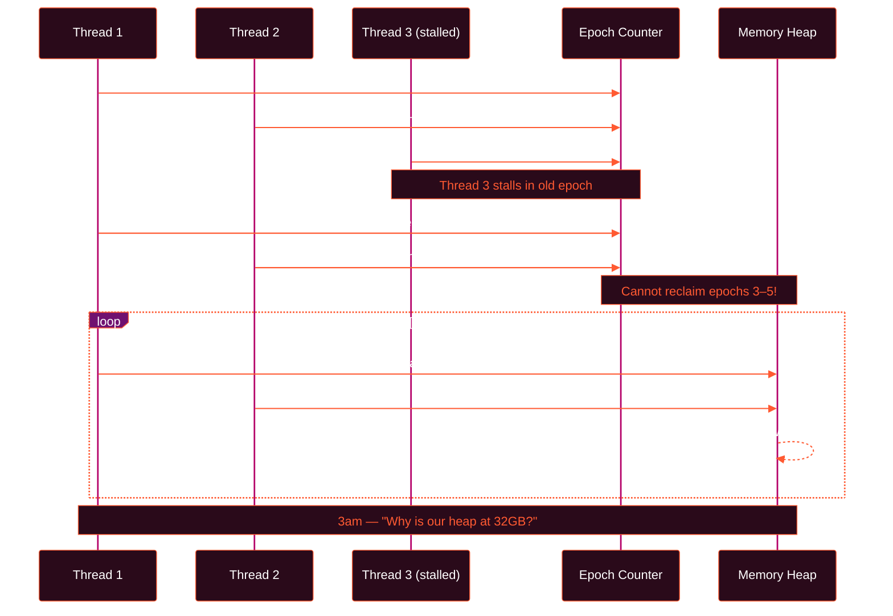
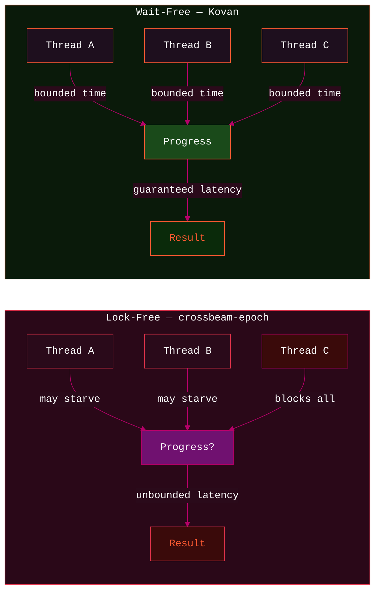
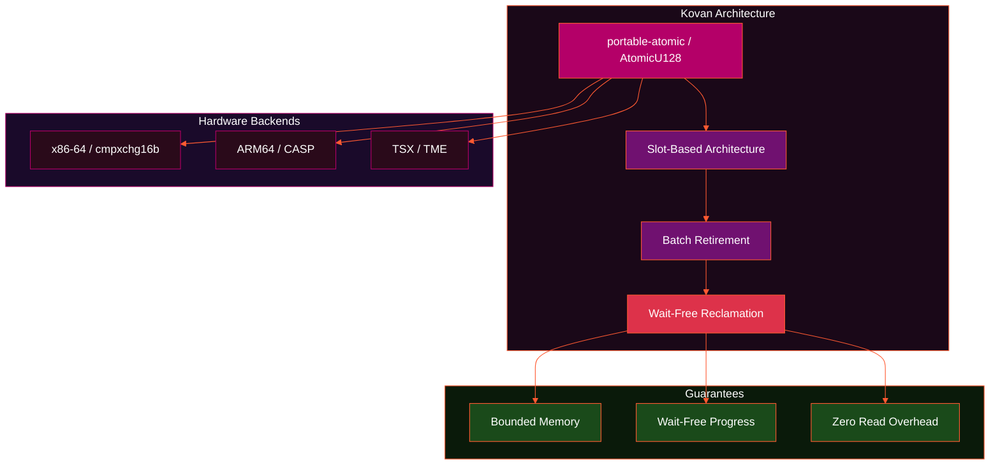
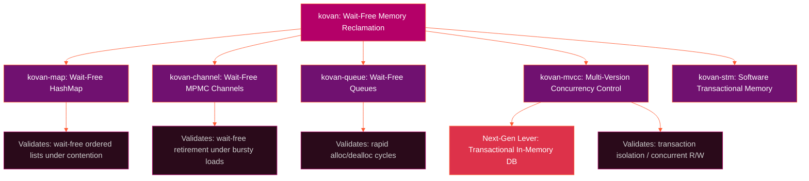
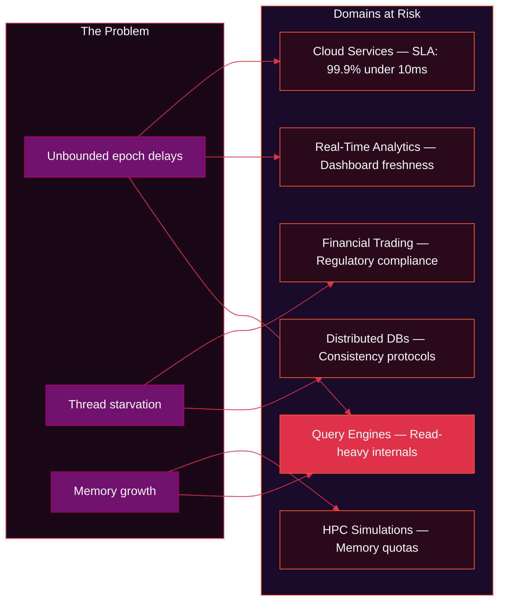
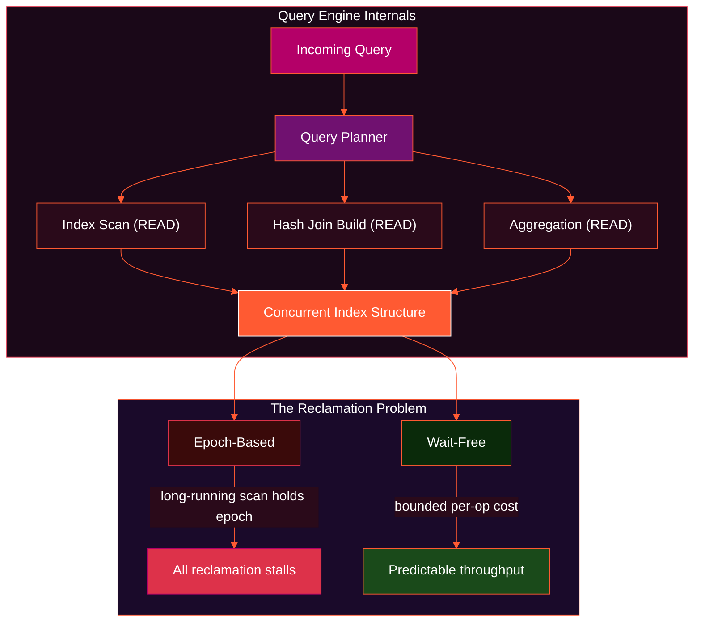

Six years ago, I started building [Lever](https://github.com/vertexclique/lever), a transactional in-memory database toolkit for production systems. The kind that needs to handle millions of operations per second with MVCC semantics, STM, and lock-free primitives. The kind where downtime isn't an option and SLA violations show up in quarterly earnings reports.

Lever worked. It's been running in production, processing **over 25 million operations in under 2 seconds**. On top of it, I built [Callysto](https://github.com/vertexclique/callysto) — a stream processing and service framework based on Lever — which has been processing messages in production across various companies. But when you're operating at that scale, you start seeing cracks in the foundation. Not bugs. *Fundamental limitations* in the tools everyone uses.

## The 3am Problem

Here's what nobody tells you about lock-free data structures: they're amazing until they're not.

Most Rust developers use `crossbeam-epoch` for memory reclamation. It's excellent engineering. Fast, battle-tested, the default choice. But it's **lock-free, not wait-free**. That sounds like splitting hairs until you're staring at production monitoring at 3am watching your 99.9th percentile latency spike from 5ms to 100ms and you have no idea why.



Lock-free means *the system* makes progress. But individual threads? They can starve indefinitely. A single stalled thread in epoch-based reclamation blocks memory reclamation for **everyone**. Memory usage becomes unbounded. Your carefully tuned heap starts growing. The garbage collector you don't have can't save you.

> For financial systems, this isn't a performance problem. It's a **compliance violation**.
> For real-time analytics, it's not a bug. It's a **broken promise** to users.
> For HPC workloads running on million-dollar machines, unbounded memory growth isn't acceptable.

## Wait-Free Isn't Just Faster

You need stronger guarantees. **Wait-freedom**: every operation completes in bounded time, period. No starvation. No unbounded memory. No "usually works." *Provably* works.



I found *"Crystalline: Fast and Memory Efficient Wait-Free Reclamation"* by Nikolaev & Ravindran ([DISC 2021](https://arxiv.org/abs/2108.02763)). Beautiful paper. Formal proofs of wait-freedom and bounded memory. Benchmarks showing performance on par with or better than epoch-based reclamation, especially for read-heavy workloads.

But papers aren't code. The gap between "theoretically sound" and "actually runs on ARM64 in production" is measured in months of grinding through edge cases, memory ordering bugs, and ABA problems that only appear under high contention.

**So I built it myself.**

## Building Kovan

[Kovan](https://github.com/vertexclique/kovan) implements Crystalline in Rust without compromising on safety or performance:



- **`portable-atomic`** for cross-platform `AtomicU128` (`cmpxchg16b` on x86-64, `CASP` on ARM64)
- **Slot-based architecture** instead of per-thread structures
- **Batch retirement** to amortize costs
- Every design decision traces back to either the paper's proofs or benchmark data

### Performance vs `crossbeam-epoch` on M-series Mac

| Metric | Kovan | crossbeam-epoch | Difference |
| :--- | :--- | :--- | :--- |
| Pin overhead | **1.26ns** | 1.98ns | **36% faster** |
| Read-heavy workloads | **1.3-1.4x faster** | baseline | Common case win |
| Mixed workloads | competitive to better | baseline | Parity or better |
| Read overhead | Single atomic load | Reference counting | **Zero overhead** |

> The read-heavy advantage isn't magic. It's what wait-free was designed for. Threads don't wait for epoch advancement. They don't wait for stragglers. **They execute.**

## An Entire Ecosystem

Memory reclamation is plumbing. It only matters if you can build real systems on top. So Kovan became a family:



Each library stress-tests different parts of the guarantee. Wait-free reclamation is a prerequisite for wait-free data structures, but not sufficient on its own — the data structure's own algorithm must also provide wait-free progress. Every library in this ecosystem satisfies both requirements. The HashMap validates wait-free progress under ordered-list contention. MVCC tests transaction isolation with concurrent readers and writers. Channels test retirement under bursty loads. The queue targets the pathological cases — rapid allocation/deallocation cycles that break naive schemes.

All of them share the same foundation: **wait-free progress, bounded memory, predictable latency.**

## Why Production Systems Need This

This isn't theoretical. Here's where wait-free guarantees matter:



**Cloud Services** — Your SLA promises 99.9% of requests in 10ms. Unbounded epoch delays violate that. Your infrastructure costs money. Memory leaks from stalled reclamation cost *more* money.

**Financial Trading** — Tail latency isn't a performance metric. It's regulatory compliance. "Usually fast enough" doesn't fly with auditors.

**Real-Time Analytics** — Query timeouts aren't negotiable when dashboards update every second. Users notice when the 99th percentile means their data is stale.

**HPC Simulations** — Running on supercomputers with job schedulers that kill processes exceeding memory quotas. Bounded memory usage isn't a nice-to-have.

**Distributed Databases** — Consistency protocols already have enough timing assumptions. Adding unbounded memory reclamation delays breaks everything.

**Query Engines & Databases** — This is the big one. Every modern database and query engine is fundamentally a read-heavy system. Think about it: even write-heavy OLTP workloads generate index lookups, constraint checks, and MVCC version traversals that *multiply every write into dozens of reads*. OLAP is even more extreme — a single analytical query scans millions of rows while writes trickle in. The internal data structures powering these systems — B-trees, skip lists, hash indexes, LSM memtables — are all concurrent structures that need safe memory reclamation under read-dominant access patterns.



Consider what happens inside a database during a typical mixed workload:

- A **long-running analytical scan** traverses an index for 500ms. With epoch-based reclamation, that thread pins an epoch the entire time. Every concurrent writer that retires nodes is now blocked from reclaiming memory — across *all threads*, not just the scanner's.
- A **hash join build phase** allocates millions of temporary nodes. When the join completes, those nodes need retirement. Under epoch reclamation, a single slow reader anywhere in the system delays cleanup of this *entire batch*.
- **MVCC version chains** grow as readers hold snapshots. Old versions can't be reclaimed until every reader advances. One straggler means the version chain grows without bound — exactly the scenario that causes your database to OOM at 3am.

This isn't hypothetical. Every database engine that uses concurrent data structures — from embedded engines like `sled` to distributed query processors — faces this problem. The read-to-write ratio in real workloads typically ranges from **10:1 to 1000:1**. That's exactly the regime where Kovan's 1.3-1.4x read-heavy advantage compounds into massive system-level gains. Every index lookup, every MVCC version traversal, every hash probe benefits from wait-free reclamation's zero-overhead reads and bounded memory.

> The irony: databases are *the* systems that need wait-free memory reclamation the most, and they're the ones most commonly using epoch-based schemes that fail under their own read-heavy access patterns.

> Wait-free isn't about being faster on average. It's about **eliminating the worst case**. It's the difference between *"works most of the time"* and *"works every time, provably."*

## Standing on Research

I didn't invent this. Nikolaev and Ravindran did the hard theoretical work. Formal proofs, algorithmic design, performance analysis across hash maps, skip lists, queues, and trees. The [DISC 2021 paper](https://arxiv.org/abs/2108.02763) shows Crystalline matching or beating hazard pointers, epoch-based reclamation, and interval-based schemes.

I implemented it. Faithfully. Then I optimized it for Rust's ecosystem, modern hardware (TSX/TME support where available), and the patterns that actually appear in production systems.

## Where We Are Now

Published on [crates.io](https://crates.io/crates/kovan). Running in production systems. I've already built [SpireDB](https://spire.zone) — a database built on this approach, proving these guarantees hold under real-world pressure. API intentionally similar to `crossbeam-epoch` because **migration matters**:

```rust
// Kovan API — familiar by design
use kovan::{pin, retire, Atomic, Shared};

let atomic = Atomic::new(Box::into_raw(Box::new(42)));

let guard = pin();
let ptr = atomic.load(Ordering::Acquire, &guard);
// Zero overhead — single atomic read

atomic.store(Shared::from(new_ptr), Ordering::Release);
retire(old_ptr.as_raw());
// Wait-free reclamation — bounded memory, guaranteed
```

The ecosystem is growing. More data structures, more optimizations, more real-world validation. I'm looking for:

- **Production use cases** that push the boundaries
- **Feedback** on what actually matters in real systems
- **Contributors** who care about correctness *and* performance
- **Workloads** that need these guarantees

## Links

- **Repository:** [github.com/vertexclique/kovan](https://github.com/vertexclique/kovan)
- **SpireDB:** [spire.zone](https://spire.zone)
- **Callysto:** [github.com/vertexclique/callysto](https://github.com/vertexclique/callysto)
- **Research Paper:** [arxiv.org/abs/2108.02763](https://arxiv.org/abs/2108.02763)
- **Lever:** [github.com/vertexclique/lever](https://github.com/vertexclique/lever)
- **Crates:** `kovan`, `kovan-map`, `kovan-channel`, `kovan-queue`, `kovan-mvcc`, `kovan-stm`

---

*This is what happens when you spend years building production systems that handle millions of operations per second, hit the theoretical limits of existing tools, read the research that solves your problem, and then spend months implementing it properly.*

*Kovan is the memory reclamation scheme I needed for systems I was already building. If you're working on concurrent systems where the worst case matters more than the average case, where SLAs are contracts not guidelines, where unbounded anything is unacceptable — this is for you.*
