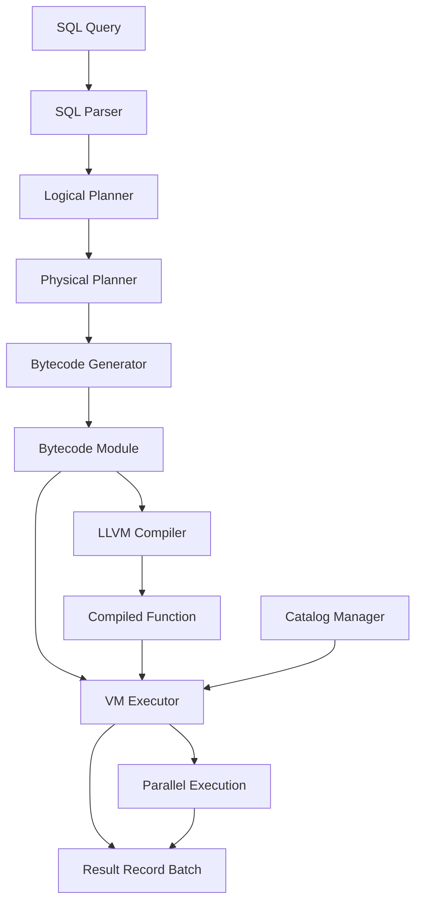
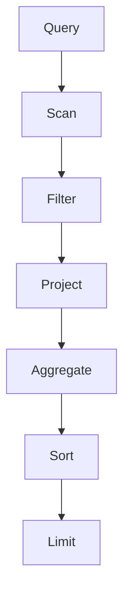
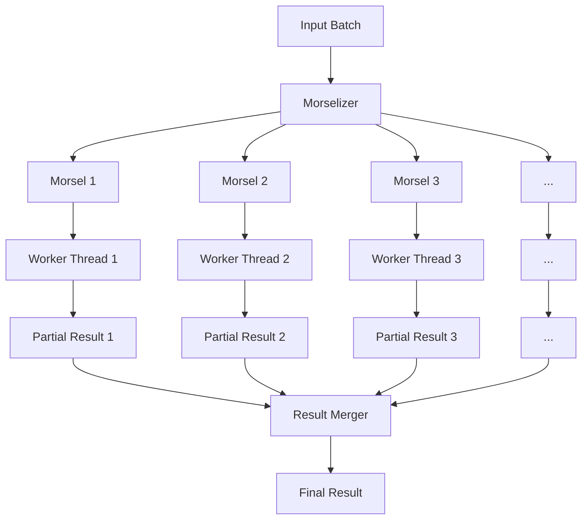
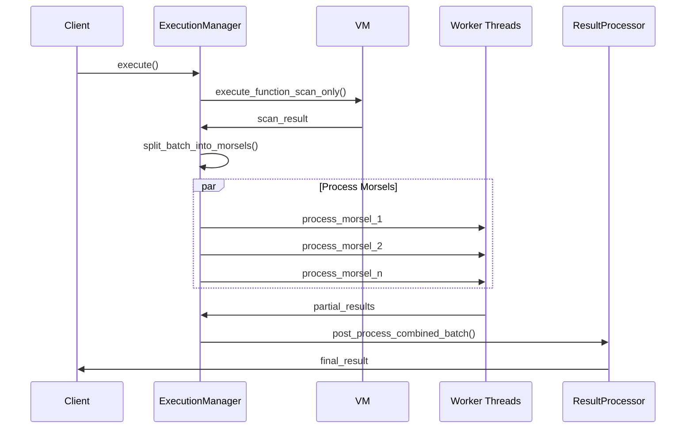

In the world of data processing, query engines are the unsung heroes that power our analytical workloads. Today, I want to share insights into ScramVM, a query engine we've built from the ground up to be fast, efficient, and adaptable. Rather than diving into intricate implementation details, I'll focus on the architectural decisions that make ScramVM unique.

## The Big Picture

ScramVM is a vectorized query engine that leverages Apache Arrow for in-memory data representation. It follows a bytecode-based execution model with runtime compilation for performance-critical paths. But what truly sets it apart is its morsel-driven parallelism strategy.

Here's a high-level view of the ScramVM architecture:



Let's break down each component and understand how they work together.

## Query Processing Pipeline

### Parsing and Planning

Like most query engines, ScramVM starts with a SQL parser (we use the sqlparser-rs crate) that converts raw SQL text into a structured abstract syntax tree (AST). The AST then goes through logical planning, where we determine what needs to be done, followed by physical planning, where we decide how to do it.

The logical planner creates a logical plan that represents the operations needed to execute the query:



The physical planner then takes this logical plan and converts it into a physical plan, considering available access methods, statistics, and optimization opportunities.

### Bytecode Generation

Once we have a physical plan, the bytecode generator comes into play. Instead of directly executing the physical plan, we first convert it into bytecode instructions. This intermediate representation offers several advantages:

1. **Portability**: Bytecode can be executed across different environments
2. **Optimization**: We can apply bytecode-level optimizations
3. **Compilation**: Bytecode can be compiled to native code for performance

Our bytecode consists of simple operations like `LoadColumn`, `Filter`, `Project`, and `Aggregate`. Here's a simplified example of what the bytecode looks like for a query that filters and projects data:

```
LoadConst 0           // Load table name
StoreLocal table_name
CreateBatch           // Scan table
StoreLocal batch
LoadLocal batch
LoadColumn 0 1        // Load column for filtering
LoadConst 1           // Load filter constant
Eq                    // Compare column to constant
FilterBatch           // Apply filter
StoreLocal filtered_batch
LoadLocal filtered_batch
ProjectBatch          // Project needed columns
StoreLocal result
Return                // Return result batch
```

## Execution Engine

The heart of ScramVM is its execution engine, which comprises two main components:

1. **VM Executor**: Interprets bytecode and performs operations on Arrow arrays
2. **LLVM Compiler**: Compiles hot paths to native code for improved performance

### Morsel-Driven Parallelism

What makes ScramVM's execution special is its morsel-driven parallel execution model. Rather than the traditional exchange-based parallelism where operators push or pull data between threads, we use a morsel-driven approach:



Here's how it works:

1. We split the input data into small chunks called "morsels"
2. Worker threads process these morsels independently
3. Results are combined at the end

This approach has several benefits:

- **Load Balancing**: Faster threads can process more morsels
- **Resource Utilization**: We can dynamically adjust morsel size based on system load
- **Locality**: We can assign morsels to threads based on NUMA topology
- **Adaptability**: The same mechanism works for both small and large datasets

## Catalog Management

The catalog system in ScramVM provides the metadata layer that enables the engine to locate and access data sources. It manages:

- Catalogs (top-level namespace)
- Schemas (collections of tables)
- Tables (actual data containers)

The catalog manager allows registration of various table types:

- **CSV Tables**: Read directly from local or remote CSV files
- **Parquet Tables**: Efficiently read from columnar Parquet files
- **Memory Tables**: In-memory tables for intermediate results or testing

## Performance Optimizations

ScramVM incorporates several performance optimizations:

### Adaptive Compilation

We use a two-tier execution model:

1. **Interpreted Mode**: Initial execution via the VM
2. **Compiled Mode**: Hot paths compiled to native code via LLVM

This approach gives us the flexibility of interpretation with the performance of compilation where it matters most.

### Parallel Processing for Large Datasets

For large datasets, we automatically switch to parallel execution:



### Dynamic Morsel Sizing

We adapt morsel sizes based on multiple factors:

- Dataset size (smaller for higher parallelism)
- Query complexity (larger for compute-intensive queries)
- System resources (adjust based on available memory)
- Hardware topology (NUMA awareness)

For billion-scale datasets, we automatically adjust morsel sizing to prevent memory pressure while ensuring sufficient parallel work.

## Bytecode Caching

To avoid redundant compilation of identical queries, we implement a bytecode caching system:

1. Generate a fingerprint for each SQL query
2. Check if bytecode exists for this fingerprint
3. Reuse cached bytecode if available

This approach significantly improves performance for repeated queries.

## Error Handling

Robust error handling is a key design principle in ScramVM. We use a structured error handling system with specific error types for different components:

- **SqlParseError**: For SQL syntax issues
- **PlanningError**: For errors during plan generation
- **ExecutionError**: For runtime execution failures
- **TyperError**: For type system issues
- **CompilationError**: For bytecode/LLVM compilation problems

This granular approach helps identify and debug issues quickly.

## Conclusion

ScramVM demonstrates how modern query engines can combine multiple execution strategies - interpretation, compilation, and parallelism - into a cohesive system. The morsel-driven execution model allows efficient utilization of modern multi-core systems, while the bytecode approach enables flexibility and optimization.

While I've only scratched the surface of ScramVM's design, I hope this gives you a useful overview of its architecture and the thinking behind it. Query engines are fascinating pieces of software that blend systems programming, compiler techniques, and distributed computing principles - all to make your data analytics faster and more efficient.

Remember, the most important part of any engineering project is the people who build and use it. Technical excellence matters, but designing with users in mind matters more. ScramVM was built with this philosophy, making complex query processing accessible and efficient for developers.

Feel free to explore the ScramVM codebase, and don't hesitate to reach out with questions or feedback!