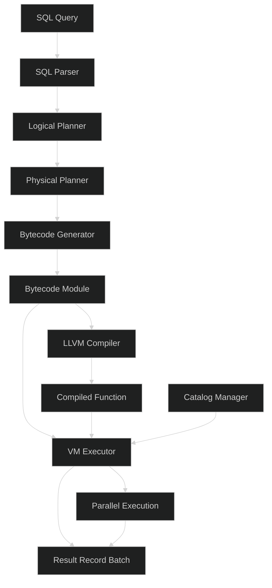
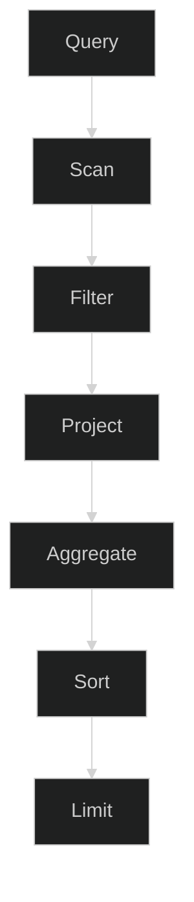
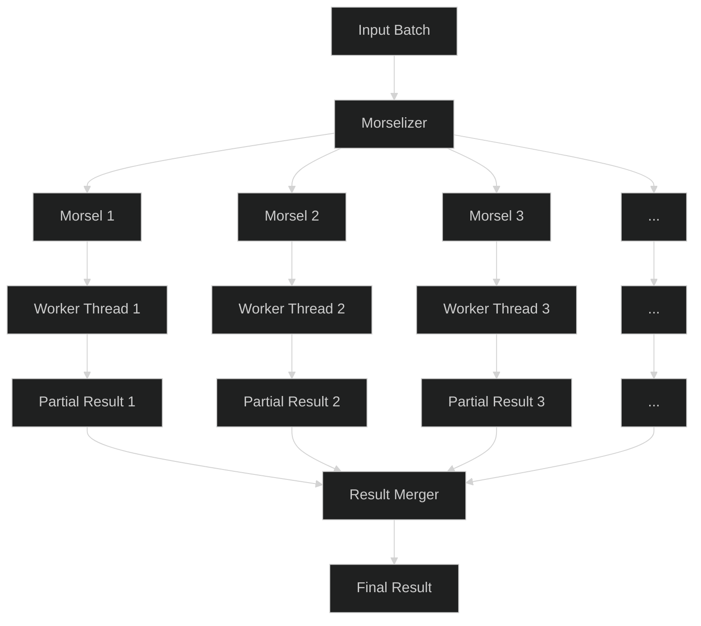
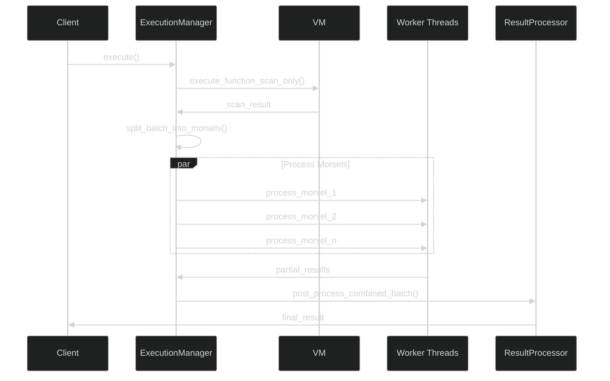

We always talk about "innovation in tech," yet much of what passes for innovation today is merely a copycat of original ideas. Looking back over the past decade, genuine breakthroughs seem limited to domains like large language models, niche work like [Cranelift's](https://github.com/bytecodealliance/wasmtime/tree/main/cranelift) compiler infrastructure, or [quantum computing advances](https://docs.quantum.ibm.com/guides/multiverse-computing-singularity) from teams like IBM's. Let's be honest: your risk model implementation, Spring Boot application, or any straightforward engineering work—regardless of how cutting-edge you believe it to be—doesn't necessarily constitute true innovation.

That said, I want to innovate—to create something that hasn't been done before, or at least not executed in the same way that research papers envision. With ScramVM, we've set out to bridge the gap between theoretical database research and practical implementation, building a query engine from the ground up to be fast, efficient, and adaptable. Rather than diving into intricate implementation details, I'll focus on the architectural decisions that make ScramVM unique.

In the world of data processing, query engines are the unsung heroes that power our analytical workloads. 
Today, I want to share insights into **ScramVM**, a query engine we've built from the ground up to be fast, 
efficient, and adaptable and soon will be available in **PulsejetDB** (our AI database developed in [JetEngine](https://jetengine.tech/)). Rather than diving into intricate implementation details, 
I'll focus on the architectural decisions that make ScramVM unique.

## Why We Built ScramVM

The rise of LLMs has created an unprecedented opportunity for businesses to extract insights from their data. However, existing solutions often fall short when it comes to efficiently integrating these powerful models with enterprise data systems. We designed ScramVM specifically to address this gap.

ScramVM serves as a high-performance foundation for:

* **LLM inference on enterprise data**: Run sophisticated language models directly against your proprietary datasets without moving data between systems, maintaining security while enabling AI-powered analytics.

* **Continuous knowledge updates**: Automatically refresh insights as new data arrives, ensuring your AI systems always operate on the most current information without manual intervention.

* **Supply chain optimization**: Track inventory, predict delivery times, optimize routing, and identify bottlenecks through complex multi-dimensional queries that traditional systems struggle to handle efficiently.

* **Real-time KPI monitoring**: Measure business performance across hundreds of metrics simultaneously, with sub-second query times even on billion-row datasets.

* **Interactive data exploration**: Enable non-technical stakeholders to ask complex questions of your data through natural language interfaces powered by the combination of LLMs and ScramVM's query capabilities.

Traditional database systems weren't designed with these workloads in mind. They either optimize for transaction processing (OLTP) or analytical queries (OLAP), but not for the unique patterns of LLM inference and continuous updates on massive datasets. ScramVM fills this gap with its morsel-driven architecture, adaptive compilation, and vectorized execution engine.

## The Big Picture

ScramVM is a vectorized query engine that leverages Apache Arrow for in-memory data representation. It follows a bytecode-based execution model with runtime compilation for performance-critical paths. But what truly sets it apart is its morsel-driven parallelism strategy.

Here's a high-level view of the ScramVM architecture:



Let's break down each component and understand how they work together.

## Query Processing Pipeline

### Parsing and Planning

Like most query engines, ScramVM starts with a SQL parser (we use the sqlparser-rs crate) that converts raw SQL text into a structured abstract syntax tree (AST). The AST then goes through logical planning, where we determine what needs to be done, followed by physical planning, where we decide how to do it.

The logical planner creates a logical plan that represents the operations needed to execute the query:



The physical planner then takes this logical plan and converts it into a physical plan, considering available access methods, statistics, and optimization opportunities.

### Bytecode Generation

Once we have a physical plan, the bytecode generator comes into play. Instead of directly executing the physical plan, we first convert it into bytecode instructions. This intermediate representation offers several advantages:

1. **Portability**: Bytecode can be executed across different environments
2. **Optimization**: We can apply bytecode-level optimizations
3. **Compilation**: Bytecode can be compiled to native code for performance

Our bytecode consists of simple operations like `LoadColumn`, `Filter`, `Project`, and `Aggregate`. Here's a simplified example of what the bytecode looks like for a query that filters and projects data:

```
LoadConst 0           // Load table name
StoreLocal table_name
CreateBatch           // Scan table
StoreLocal batch
LoadLocal batch
LoadColumn 0 1        // Load column for filtering
LoadConst 1           // Load filter constant
Eq                    // Compare column to constant
FilterBatch           // Apply filter
StoreLocal filtered_batch
LoadLocal filtered_batch
ProjectBatch          // Project needed columns
StoreLocal result
Return                // Return result batch
```

## Execution Engine

The heart of ScramVM is its execution engine, which comprises two main components:

1. **VM Executor**: Interprets bytecode and performs operations on Arrow arrays
2. **LLVM Compiler**: Compiles hot paths to native code for improved performance

### Morsel-Driven Parallelism

What makes ScramVM's execution special is its morsel-driven parallel execution model. Rather than the traditional exchange-based parallelism where operators push or pull data between threads, we use a morsel-driven approach.

> Our beloved [Datafusion](https://github.com/apache/datafusion) (yes beloved, because I used and developed Arrow Rust & Datafusion and contributed some parts of it), is working on push/pull volcano model. We are not following the same route but trying to use [this](https://db.in.tum.de/~leis/papers/morsels.pdf) approach.



Here's how it works:

1. We split the input data into small chunks called "morsels"
2. Worker threads process these morsels independently
3. Results are combined at the end

This approach has several benefits:

- **Load Balancing**: Faster threads can process more morsels
- **Resource Utilization**: We can dynamically adjust morsel size based on system load
- **Locality**: We can assign morsels to threads based on NUMA topology
- **Adaptability**: The same mechanism works for both small and large datasets

## Catalog Management

The catalog system in ScramVM provides the metadata layer that enables the engine to locate and access data sources. It manages:

- Catalogs (top-level namespace)
- Schemas (collections of tables)
- Tables (actual data containers)

The catalog manager allows registration of various table types:

- **CSV Tables**: Read directly from local or remote CSV files
- **Parquet Tables**: Efficiently read from columnar Parquet files
- **Memory Tables**: In-memory tables for intermediate results or testing

## Performance Optimizations

ScramVM incorporates several performance optimizations:

### Adaptive Compilation

We use a two-tier execution model:

1. **Interpreted Mode**: Initial execution via the VM
2. **Compiled Mode**: Hot paths compiled to native code via LLVM

This approach gives us the flexibility of interpretation with the performance of compilation where it matters most.

### Parallel Processing for Large Datasets

For large datasets, we automatically switch to parallel execution:



### Dynamic Morsel Sizing

We adapt morsel sizes based on multiple factors:

- Dataset size (smaller for higher parallelism)
- Query complexity (larger for compute-intensive queries)
- System resources (adjust based on available memory)
- Hardware topology (NUMA awareness)

For billion-scale datasets, we automatically adjust morsel sizing to prevent memory pressure while ensuring sufficient parallel work.

## Bytecode Caching

To avoid redundant compilation of identical queries, we implement a bytecode caching system:

1. Generate a fingerprint for each SQL query
2. Check if bytecode exists for this fingerprint
3. Reuse cached bytecode if available

This approach significantly improves performance for repeated queries.

## Benchmarking: The 1 Billion Row Challenge

To demonstrate ScramVM's capabilities, we put it to the test against the [1 Billion Row Challenge (1BRC)](https://github.com/gunnarmorling/1brc) - a popular benchmark that tests the performance of data processing systems on a weather station dataset with one billion rows. And here is the query given to **ScramVM**:

```sql
SELECT
column_0 as city,
MIN(column_1) AS min_temp,
AVG(column_1) AS mean_temp,
MAX(column_1) AS max_temp
FROM
    weather
GROUP BY
    column_0
ORDER BY
    column_0;
```

ScramVM was able to perform complex aggregations (min, max, and average calculations) across all one billion rows in just **77.6 milliseconds**. For context, this is how our results compare to the top Rust implementations from the official 1BRC challenge:

| Implementation (Author/Repository - if known) | Key Techniques Used                                      | Time - Reported Benchmark (Approximate) | Notes                                                                                                                               |
| :--------------------------------------------- | :------------------------------------------------------- | :------------------------------- | :---------------------------------------------------------------------------------------------------------------------------------- |
| **Jet-Engine/ScramVM** | Morsel-driven query engine with bytecode compilation | 77.6 ms | Generic craft. No dataset specific optimization, allocation optimization, and reading optimization.
| **phip1611/1brc-rust** | `mmap`, `memchr` for parsing, integer temperature, no allocations on hot path, multi-threading | ~1.7 seconds (16 threads)        | Highly optimized, leverages low-level techniques and avoids allocations. Explicitly tuned for the challenge dataset.           |
| **thebracket/one_billion_rows** | `memmap2`, per-thread `ahash::HashMap`, chunking         | < 2 seconds (warm cache)         | Achieved significant speedups using memory mapping and per-thread processing.                                                     |
| **RagnarGrootKoerkamp/1brc** | Optimized techniques (details often discussed in issues) | ~2 seconds (Ryzen 5 3600x)       | Frequently mentioned as one of the fastest overall implementations in the discussions.                                              |
| **beowolx/fast_1brc** | Chunk-based reading, `crossbeam`, SIMD for newline, `fast_float`, per-thread `FxHashMap` | Not precisely stated, likely fast | Emphasizes SIMD and parallel processing for speed.                                                                                |
| **danieljl/rust-1B-row-challenge** | `hashbrown::HashMap`, `crossbeam_channel` for threading | 5 - 8 seconds (MBP 2019)         | Focuses on general-purpose parsing and hashing. Mentioned as a fast implementation in discussions.                                 |
| **Naveenaidu/rust-1brc** | Iterative optimizations, `BufReader`, `FxHashMap`, `mmap`, parallelization | ~9 seconds (final optimized)   | Well-documented journey of optimization techniques and their impact on performance.                                            |
| **Memory-Mapped Files (`memmap2`)** | Mapping the file into memory                             | 2 - 9 seconds                    | Very effective when the file fits in RAM or when the OS handles memory efficiently.                                                 |
| **Parallel Processing (Rayon/`std::thread`)** | Multi-threading to process chunks of the file           | 10 - 30 seconds                  | Depends on the number of cores and how well the work is distributed. Lock contention can be an issue.                               |
| **Optimized `HashMap`** | Using `FxHashMap` or `ahash`                             | 30 seconds - few minutes         | Significant improvement over the default `HashMap`.                                                                                 |
| **Naive Implementation** | Basic line-by-line processing, `HashMap`                | Several minutes                  | Initial attempts, used as a baseline for optimization.                                                                             |


ScramVM outperforms the top Rust implementations by nearly an order of magnitude. This is particularly impressive considering that most 1BRC submissions are highly specialized, single-purpose applications optimized specifically for this task, while ScramVM is a general-purpose query engine.

The key factors contributing to ScramVM's performance include:

1. **Intelligent morsel sizing**: Dynamically adjusting work chunks for optimal parallelism
2. **NUMA-aware scheduling**: Placing computation close to the data
3. **Vectorized execution**: Processing multiple values simultaneously using Arrow
4. **Just-in-time compilation**: Converting critical code paths to native machine code
5. **Optimized memory management**: Minimizing allocations and copies

This benchmark demonstrates that ScramVM's architecture isn't just theoretically sound – it delivers exceptional performance on real-world data processing tasks.

## Conclusion

ScramVM is truly how modern query engines can combine multiple execution strategies - interpretation, compilation, and parallelism - into a cohesive system. The morsel-driven execution model allows efficient utilization of modern multi-core systems, while the bytecode approach enables flexibility and optimization.

While I've only scratched the surface of ScramVM's design, I hope this gives you a useful overview of its architecture and the thinking behind it. Query engines are fascinating pieces of software that blend systems programming, compiler techniques, and distributed computing principles - all to make your data analytics faster and more efficient.

Remember, the most important part of any engineering project is the people who build and use it. Technical excellence matters, but designing with users in mind matters more. ScramVM was built with this philosophy, making complex query processing accessible and efficient for developers.

Soon you will lay your hands on the ScramVM and you can be able to use it with PulsejetDB too. Looking forward to that day! 

### People Part - A Call to Fellow Builders

Many of us have experienced working environments where knowledge sharing takes a backseat to knowledge hoarding. We've seen how this dynamic can create unnecessary self-doubt among talented team members. This pattern manifests across all levels—from individual contributors to leadership teams. In many corners of the tech industry, we've observed a tendency to prioritize appearances over substance, where familiarity with the latest buzzwords sometimes carries more weight than deep technical understanding.

This extends beyond individual interactions to how organizations function. Many companies naturally gravitate toward quick wins and immediate results, sometimes at the expense of the foundational work that enables true innovation—work that requires time, deep thinking, and the space to learn from inevitable setbacks. Industry discussions often focus on trends rather than fundamentals, limiting opportunities for meaningful advancement.

What's challenging is the mixed messaging many teams receive. On one hand, long hours and constant availability are implicitly expected; on the other hand, teams that put in tremendous effort without corresponding results are sometimes celebrated just the same as those who deliver. This disconnect between effort and outcomes creates confusion about what truly matters.

Send an email to `info <ta> jetengine <tod> tech` with a brief introduction about yourself and what excites you about building deep tech solutions. We look forward to connecting with like-minded builders.


**Treffpunkt: ScramVM!**